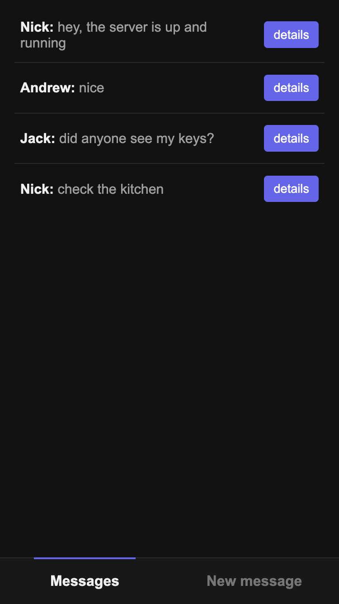
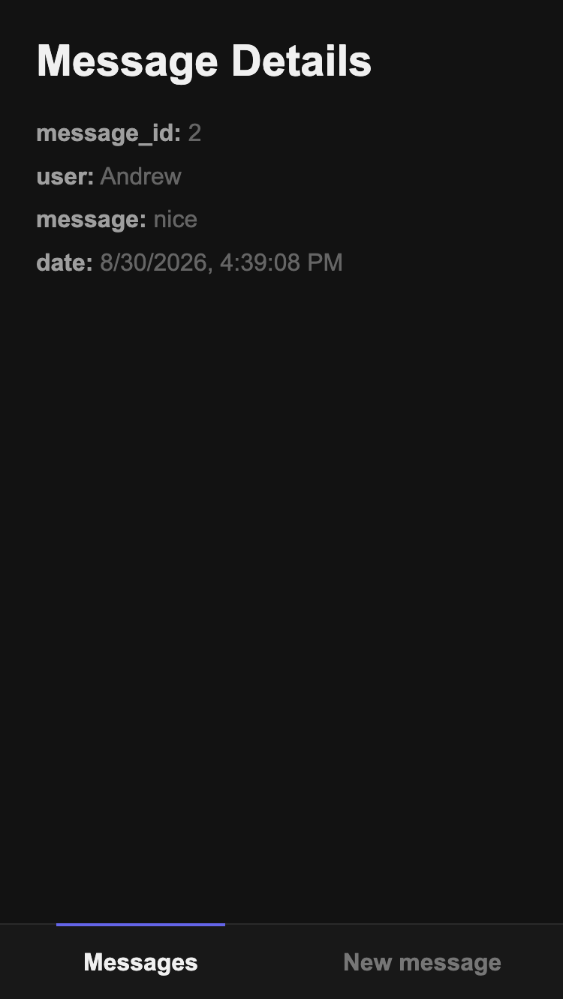
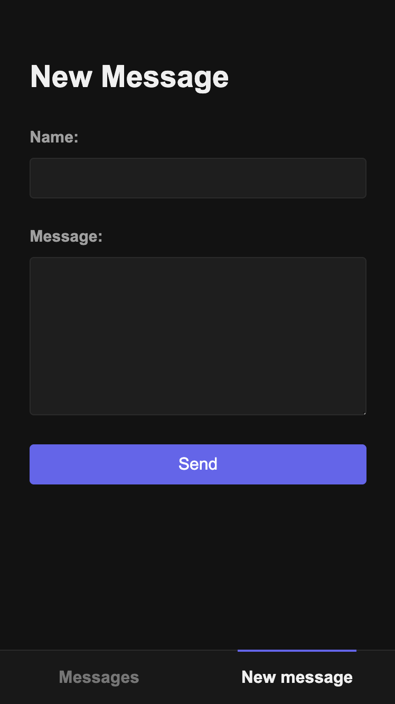

# Message Board

A message board built with Node.js and Express. It does not use a database, so messages are stored in memory while the server is running. This means that different users can access the same board and exchange messages by refreshing the page, as long as the server remains active.

🔗 [Live Demo](https://message-board-awae.onrender.com/messages)

## Screenshots

  
  
  

## Features

- View messages and their details
- Create new messages
- Bottom navigation between pages
- Custom 404 error page
- Responsive design

## Built with

- Node.js
- Express
- EJS
- CSS